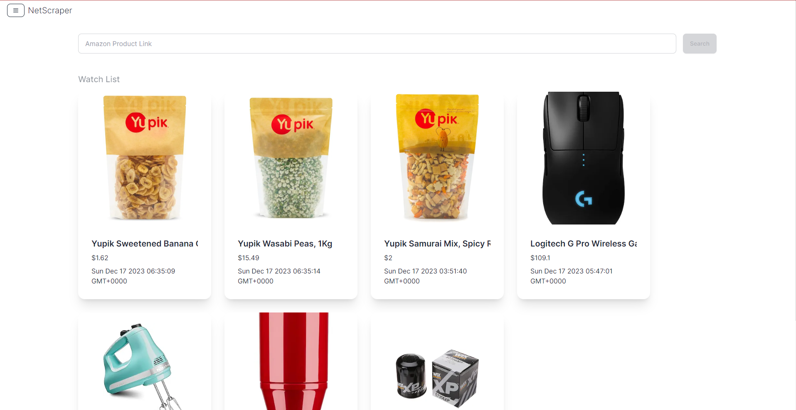
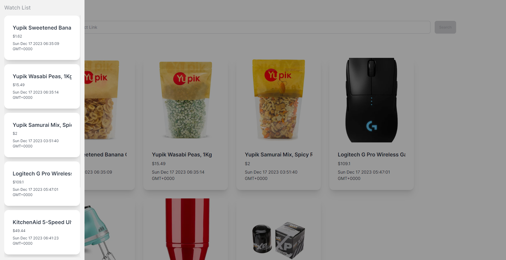
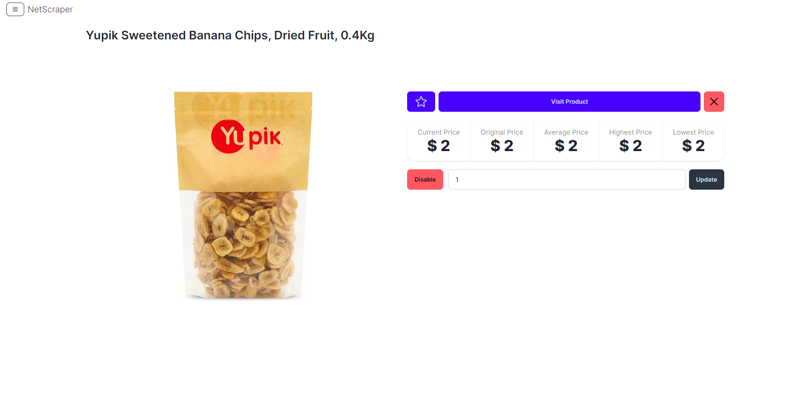
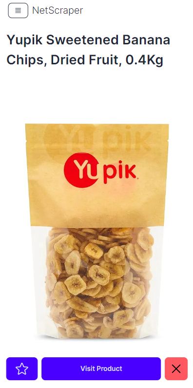
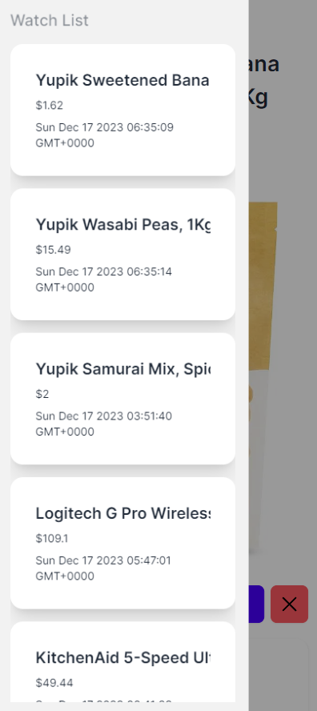

# NetScraper - Web Scrapper

NetScraper is a cutting-edge web scraping solution developed using Next.js, tailored for efficient and dynamic data extraction from various web sources. This project leverages the power of modern web technologies to provide a seamless and user-friendly experience for scraping data, coupled with robust back-end management using MongoDB and Mongoose.

## Description

### Key Features:

- Dynamic Web Scraping: Utilizes advanced techniques to scrape data from multiple web sources efficiently.
- User-Friendly Interface: Built with Tailwind CSS and DaisyUI for an intuitive and responsive user experience.
- Data Management: Robust back-end architecture using MongoDB and Mongoose for effective data storage and retrieval.
- Customizable Scraping: Users can specify parameters for scraping, allowing for targeted data extraction.
- Real-Time Notifications: Implements React Hot Toast for immediate feedback during web scraping operations.
- Email Integration: Features Nodemailer for sending notifications or reports via email.
- Comprehensive Date Handling: Utilizes Moment.js for handling and displaying dates and times effectively.
- Responsive Design: Ensures a seamless experience across different devices and screen sizes.

### Technologies Used:

- Next.js (v14.0.3): A React framework for building server-rendered applications.
- Tailwind CSS (v3.3.0): A utility-first CSS framework for rapidly building custom designs.
- DaisyUI (v4.4.19): Tailwind CSS component library for building beautiful UIs effortlessly.
- React (v18): A JavaScript library for building user interfaces.
- Heroicons: A set of free MIT-licensed high-quality SVG icons.
- MongoDB: NoSQL database for storing scraped data.
- Mongoose (v8.0.3): MongoDB object modeling for Node.js.
- Cheerio (v1.0.0-rc.12): Fast, flexible & lean implementation of core jQuery designed specifically for the server.
- Axios (v1.6.2): Promise-based HTTP client for making HTTP requests.
- Nodemailer (v6.9.7): Module for sending emails.
- Moment.js (v2.29.4): Parse, validate, manipulate, and display dates and times in JavaScript.
- React Hot Toast (v2.4.1): Smoking hot React notifications.
- ESLint (v8): Pluggable JavaScript linter.
- Prettier (v3.1.0): Code formatter.
- Husky (v8.0.3): Modern native Git hooks made easy.
- Cypress (v13.6.1): End-to-end testing framework.
- TypeScript (v5): Typed superset of JavaScript that compiles to plain JavaScript.

## Screenshots

## How to Install and Run

### Install

1. Clone the repository: git clone `https://github.com/KBMaglalang/netscraper`
2. Navigate to the directory: `cd netscraper`
3. Install dependencies: `pnpm install`
4. Copy `.env.example` to `.env`
5. Populate the `.env` file with necessary values and permissions.

### Run

1. Start the server: `pnpm dev`
2. Access the app at localhost:3000 or the provided link in the terminal
